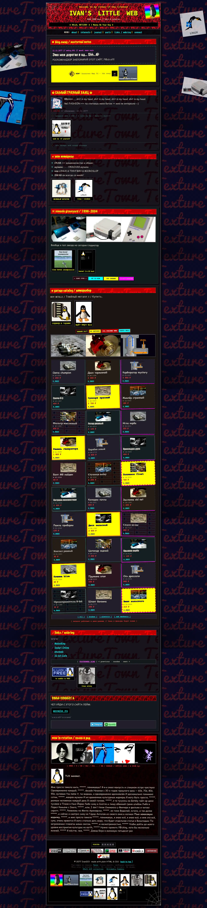

# Ivan's Little Web

Статичный сайт в эстетике персонального Web 1.0: GIF-фактуры, кнопки 88×31, кривые рамки, гаражный каталог.

В браузере работают только HTML и CSS. Go нужен как локальный сервер, Node — только для линтеров. Ни сборки, ни фреймворков, ни внешнего runtime: сайт полностью работоспособен без Node.



## Запуск

Нужен [Go](https://go.dev/dl/) 1.24 или новее.

```bash
go run .
```

Открой `http://localhost:8080`, останови по `Ctrl+C`. Порт 8080 захардкожен в `main.go`.

Сборка и фоновый запуск на macOS:

```bash
go build -o site-server .
nohup ./site-server > server.log 2>&1 < /dev/null &
echo $! > server.pid
kill $(cat server.pid)          # остановить
```

## Проверки

```bash
npm install                     # ~120 пакетов, один раз, только для разработки
npm run lint                    # формат + CSS + Go + бюджет
npm run fix                     # форматирование и автоисправления
```

| Команда                | Что делает                                     |
| ---------------------- | ---------------------------------------------- |
| `npm run format`       | Prettier: HTML, CSS, JSON, YAML, Markdown      |
| `npm run format:check` | То же, ничего не меняя (режим CI)              |
| `npm run lint:css`     | Stylelint по `style.css`                       |
| `npm run lint:go`      | `gofmt -l` и `go vet ./...`                    |
| `npm run size`         | Сумма `index.html` + `style.css` против лимита |

Три настройки, которые стоит оставить как есть — они легко ломаются случайной «починкой»:

**`printWidth: 120` в Prettier.** На дефолтных 80 символах HTML раздувался с 25 КБ до 36 КБ — в разметке есть строки с длинными списками атрибутов. На 120 HTML прибавляет 4 КБ.

**`htmlWhitespaceSensitivity: "css"`.** Вёрстка держится на `inline-block` внутри `.parts-grid`, `.tux-strip`, `.banner-strip`, `.swag-banners`, где расстояние задавали пробелы в разметке. Prettier эти пробелы переставляет, поэтому у прижатых контейнеров выставлен `font-size: 0`, а размер шрифта возвращают дочерние элементы. Совпадение геометрии до и после форматирования проверено сравнением ~100 элементов.

**Стилевые правила Stylelint отключены.** На `stylelint-config-standard` было 177 замечаний, 109 из них — `declaration-block-single-line-max-declarations`, то есть война с самим стилем проекта «одна строка = одно правило». После прогона Prettier проблем становилось не меньше, а больше. Остались только содержательные проверки: опечатки в свойствах, неизвестные единицы, дубликаты селекторов.

`assets/` исключён из Prettier — там бинарные GIF и написанные вручную SVG-текстуры.

## Структура

```text
web1-personal-site/
├── index.html                    Главная страница и весь контент.
├── style.css                     Стили, фактуры, сетки, адаптивность.
├── main.go                       Go-сервер на стандартной библиотеке.
├── go.mod                        Go-модуль, нужен для сборки.
├── package.json                  Скрипты проверок.
├── scripts/check-size.sh         Бюджет HTML+CSS.
├── .github/workflows/ci.yml      Проверки и деплой.
├── deploy/                       Юнит systemd, конфиг nginx, разовая настройка сервера.
├── docs/preview.webp             Скриншот для этого файла.
└── assets/
    ├── favicon.gif               Иконка во вкладке.
    ├── tile.svg                  Фактура для фона.
    ├── font/                     Локальные шрифты (латиница и кириллица отдельно).
    ├── ico/                      Кнопки и баннеры 88×31.
    ├── img/                      Фото, GIF-украшения, картинки каталога.
    └── tile/                     Дополнительные фактуры.
```

Рядом с бинарником появляется `visits.dat` — счётчик визитов. Он в `.gitignore` и наружу не раздаётся.

## Как оно устроено

### Страница

`index.html` — единственная страница. Якоря: `#content`, `#about`, `#interests`, `#journal`, `#consoles`, `#parts`, `#links`, `#guestbook`, `#rotation`.

Каталог — 30 карточек, статический HTML: цены, артикулы и ссылки прописаны вручную, кнопки ведут на `mailto:`.

В футере вместо числа визитов стоит метка `<!--visits-->`, её заменяет сервер. Если открыть файл без сервера, на месте цифр будет пусто — остальное работает.

### Стили

CSS отвечает за GIF-фактуры, SVG-паутину в углах, наклейки по краям, рамки `ridge`/`outset`/`inset`/`groove`, наклоны секций и адаптив.

Типографика разложена по ролям: `Press Start 2P` — шапка, `Pixelify Sans` — меню и служебные подписи, `Marker Felt`/`Palatino Linotype` — заголовки, `Comic Sans MS` — основной текст. Разные шрифты карточек каталога — намеренный хаос.

С кириллицей здесь есть неочевидная ловушка. `Press Start 2P` и `Pixelify Sans` нарезаны на два файла — отдельно латиница, отдельно кириллица, — и какой из них качать, решает `unicode-range` в `@font-face`. Если объявить только один файл, половина текста молча уедет в системный шрифт.

Раньше в `h1` лежал файл `press-start-2p-cyr.woff2`, в котором была **только кириллица** без латиницы: английский заголовок рисовался запасным шрифтом, а русские буквы — пиксельным. Подписи и меню стояли на `VT323`, у которого кириллицы нет вообще ни в одной версии, поэтому вся кириллица в них была системной. Сейчас оба шрифта полные, `VT323` и неиспользуемый `Special Elite` удалены.

`Marker Felt` и `Comic Sans MS` — системные шрифты с кириллицей в комплекте, их браузер подменяет сам.

### Сервер

`main.go` использует только стандартную библиотеку и раздаёт **не всю папку**: открыты `index.html`, `style.css` и `assets/`, остальное отдаёт 404.

```go
allowedStatic := map[string]bool{"/style.css": true}
```

Раньше сервер отдавал корень целиком, и по HTTP были доступны `main.go`, `README.md`, `server.log`, `go.mod` и бинарник на 8 МБ. Путь нормализуется через `path.Clean` **до** проверки префикса, поэтому `/assets/../main.go` и закодированные `%2e%2e` тоже закрыты (проверено).

Главную страницу отдаёт не файловый сервер, а отдельный обработчик: он читает `index.html`, подставляет счётчик и только потом отправляет ответ. Файл на диске при этом не меняется, поэтому `index.html` остаётся обычной статикой — его можно открыть двойным щелчком без сервера.

### Счётчик визитов

Живое место на сайте ровно одно — счётчик в футере. В вёрстке вместо цифр стоит метка `<!--visits-->`, а `main.go` заменяет её на `<span>` с числом:

```go
html := strings.Replace(string(page), visitMark, counterHTML(hit()), 1)
```

Число лежит в файле (в проде `/var/lib/9site/visits.dat`, локально `visits.dat` рядом с бинарником, путь переопределяется через `VISITS_FILE`). Запись идёт на каждый заход через временный файл с последующим `os.Rename`: переименование в пределах одной файловой системы атомарно, поэтому при обрыве не останется половинчатого файла. Счёт поднимается и при перезапуске, и при 30 параллельных запросах — проверено, прирост ровно 30. Отсутствующий или битый файл не мешает запуску: сервер пишет в лог и начинает с нуля.

До пяти знаков число добивается нулями, чтобы разрядность в футере не прыгала, дальше растёт как есть. Ответ идёт с `Cache-Control: no-store`, иначе браузер показывал бы вчерашний счёт.

В `deploy/9site.service` для этого добавлены `StateDirectory=9site` и `Environment=VISITS_FILE=...`: при `ProtectSystem=strict` это единственный каталог, доступный сервису на запись. Сам файл счётчика наружу не отдаётся — в `allowedStatic` его нет.

Базы данных, API и авторизации по-прежнему нет.

### Бюджет размера

`scripts/check-size.sh` следит за суммой `index.html` + `style.css`. Сейчас 51 КБ при пороге 60 КБ, порог задаётся через `SIZE_LIMIT`:

```bash
SIZE_LIMIT=30720 npm run size   # строгая проверка на 30 КБ
```

Исходное ТЗ требовало 30 КБ. Порог поднят осознанно: к моменту настройки сумма уже была 42 КБ, форматирование добавляет ещё 6 КБ. Чтобы вернуться в 30 КБ, резать надо длинные абзацы в `#rotation` — они занимают больше половины страницы.

## CI/CD

`.github/workflows/ci.yml` состоит из двух джобов.

**`checks`** — на каждый пуш в `main`, на каждый pull request и вручную: `npm ci`, `prettier --check`, `stylelint`, `gofmt`, `go vet`, `go build`, бюджет размера.

**`deploy`** — за проверками, только при пуше в `main`. Собирает сервер под Linux с `-trimpath -ldflags="-s -w"`, заливает по rsync статику и бинарник, перезапускает сервис.

После деплоя проверяются не только коды ответов (сайт открывается, закрытые файлы остаются закрытыми), но и сам счётчик: CI делает два запроса к главной и убеждается, что число поднялось ровно на единицу.

Деплой молчит, пока не выполнены оба условия: выставлена переменная `DEPLOY_ENABLED=true` и заполнены секреты. Пока их нет, CI прогоняет проверки и ничего не трогает.

**Variables** (Settings → Secrets and variables → Actions):

| Переменная           | Значение                                    |
| -------------------- | ------------------------------------------- |
| `DEPLOY_ENABLED`     | `true`, когда сервер готов принимать деплой |
| `DEPLOY_RESTART_CMD` | команда перезапуска сервиса, необязательна  |

**Secrets:**

| Секрет            | Значение                                            |
| ----------------- | --------------------------------------------------- |
| `SSH_HOST`        | адрес сервера                                       |
| `SSH_PORT`        | порт SSH, обычно `22`                               |
| `SSH_USER`        | пользователь деплоя                                 |
| `SSH_PRIVATE_KEY` | приватный ключ целиком, со строками `BEGIN` и `END` |
| `DEPLOY_PATH`     | абсолютный путь, например `/var/www/ivan-web`       |

На сервере нужны только `rsync` и `sshd`. Публичную часть ключа — в `~/.ssh/authorized_keys` пользователя деплоя. Без `DEPLOY_RESTART_CMD` деплой обновит файлы, но сервис придётся перезапускать вручную или через systemd.

## Ассеты

Всё скачано и лежит локально, во время работы ничего не подгружается с CDN:

- фактуры TextureTown;
- кнопки 88×31 из коллекции DABAMOS: Telegram и Spotify, а также GitHub, Steam, Reddit и Twitter;
- фотографии консолей и автодеталей из Wikimedia Commons;
- шрифты Press Start 2P и Pixelify Sans (каждый двумя файлами: латиница и кириллица);
- GIF с Tux со страниц Tenor;
- обложки альбомов 9mice и Kai Angel.

Обложки альбомов — чужая интеллектуальная собственность. Для локального проекта это неважно, но при публикации в открытый доступ вопросы могут возникнуть у правообладателя.

Кнопки 88×31 из коллекции DABAMOS автор разрешает копировать себе, но просит не хотлинкать — файлы лежат в `assets/ico/`.

## Ограничения

- Порт 8080 захардкожен, HTTPS и домена нет.
- Базы данных нет, форма гостевой книги — ссылка на email.
- В блоке SWAG CONNECT подставлены только ссылки на Telegram, Spotify, Twitter и Reddit. GitHub (`https://github.com/USERNAME`) и Steam (`https://steamcommunity.com/id/USERNAME`) — заглушки, нужны настоящие адреса; они лежат в `index.html` в списке `.social-links` и на кнопках `github.gif` / `steam.gif`.
- Счётчик считает заходы, а не посетителей: `F5` и обновления страницы увеличивают число. Защита от накрутки не делалась.
- Каталог демонстрационный, заказы не оформляет.
- Часть картинок тяжелее 50 КБ, хотя ТЗ просило ужимать каждую до этого предела: `car-parts.png` (862 КБ), `junkyard-engines.jpg` (735 КБ), `avatar-anime.gif` (649 КБ), `kaiangel-album-shh1.jpg` (578 КБ), `console-3ds.jpg` (430 КБ).
- React/TypeScript из старой версии лежат отдельно в `web1-personal-site-ts-backup`, текущая версия их не использует.
